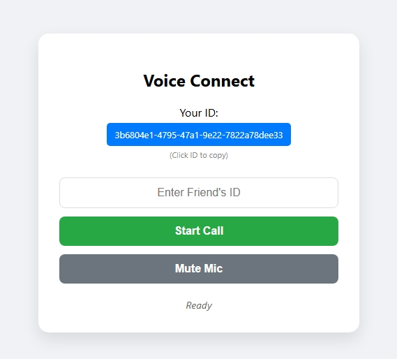

# 🎙️ PeeP

A professional, real-time browser-to-browser voice calling application built with **Node.js**, **WebRTC**, and **PeerJS**. This project features low-latency audio communication, a modern UI, and a playful user experience.



## 🚀 Key Features

* **P2P Audio Streaming**: Direct browser-to-browser communication using WebRTC for minimal latency.
* **Signaling Server**: Custom backend built with Node.js and `ExpressPeerServer`.
* **Interactive UI**:
    * **Click-to-Copy ID**: Instantly copy your unique Peer ID to your clipboard.
    * **Mute Functionality**: Easily toggle your microphone during calls.
    * **Real-time Status**: Monitors connection states (Calling, Connected, Partner Left).
* **Custom Audio Triggers**:
    * Dynamic ringtone for incoming calls.
    * **Easter Egg**: A "Loneliness Check" that plays a custom track if a user attempts to call themselves.
* **Immediate Disconnect**: Automatic call termination logic if a user closes their browser tab.

## 🛠️ Tech Stack

* **Frontend**: HTML5, CSS3, Vanilla JavaScript
* **Backend**: Node.js, Express.js
* **Engine**: [PeerJS](https://peerjs.com/) (WebRTC simplified)
* **Tunneling**: [ngrok](https://ngrok.com/) (Recommended for testing HTTPS/Microphone access)

## 📦 Installation & Setup

### 1. Clone the repository
```bash
mkdir voice-connect-pro
cd voice-connect-pro
